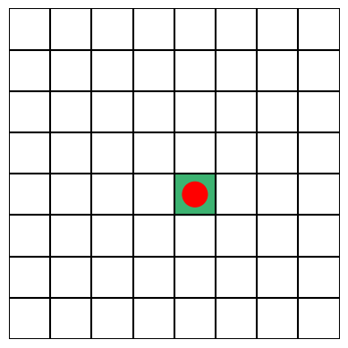
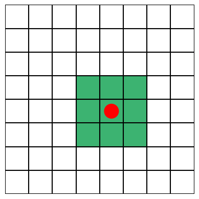
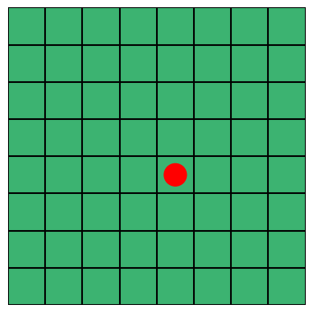

# Introduction

Simplified PyTorch implementation of one-stage detector: YOLO (You Only Look Once) with custom label assignment methods, support multi-gpu training and validating, automatic mixed precision training etc.  

# Requirements

torch == 1.8.1  
torchmetrics  
albumentations  
loguru  
tqdm  
faster-coco-eval  
pycocotools  


# Label assignment
Label assignment plays a crucial role in object detection by determining how GT boxes are matched to anchors or grid cells during training. This step directly influences the quality of supervision signals the detector receives, and even small changes in the assignment strategy can lead to notable differences in performance. Over the years, various methods have been proposed, ranging from simple IoU-based methods to more dynamic and learnable strategies, each aiming to improve the balance between positive and negative samples and better reflect object scale, position, or context.

This repo provides several simple IoU-based label assignment methods that are easy to understand and efficient to implement. These include fixed strategies that assign GTs based on overlap with anchors. While more advanced dynamic or learnable assignment techniques e.g. those used in ATSS or SimOTA, currently they are not included in this repo.

<details><summary>Single Grid Assigment</summary>

In this approach, each GT box is assigned to the grid cell in which its center falls. Only the anchors located within this grid cell are considered for matching. For example, if each grid cell contains multiple predefined anchors (e.g., 3 anchors of different aspect ratios and different sizes), the IoU between the GT box and each anchor is computed. These IoUs are then compared against a predefined threshold `match_iou_thres`: if any of them exceed the threshold, the GT is assigned to the corresponding anchor; otherwise, no assignment is made.

In fact, a similar strategy was used in the original YOLOv1 model, where each object was assigned to the grid cell containing its center, and only that cell was responsible for predicting the object's presence and bounding box.



</details>

<details><summary>Nearby Grid Assignment</summary>

In this approach, the matching region is expanded to include the 3×3 neighborhood centered around GT cell. Anchors from all 9 grid cells are considered for assignment. For each anchor in this region, the IoU with the GT box is calculated, and assignments are made based on whether the IoU exceeds a predefined threshold `match_iou_thres`.

In cases where multiple GTs could potentially match the same anchor, this method provides an optional filtering mechanism controlled by the `filter_by_max_iou` parameter. When enabled, the anchor is assigned only to the GT with the highest IoU among all matches. When disabled, one of the matching GTs is randomly selected for assignment.

A similar assignment strategy is adopted in YOLOv5, where each GT box is assigned to the grid cell containing its center, along with up to two neighboring cells whose centers are closest to the object center. However, unlike this method, which uses an IoU threshold to filter matching anchors, YOLOv5 relies on aspect ratio similarity between the GT box and predefined anchors to determine valid matches.



</details>

<details><summary>All Grid Assignment</summary>

In this approach, all anchors across the entire grid for each GT box are considered. For every anchor in the feature map, the IoU with each GT is calculated. The anchor is then assigned to the GT box with which it has the highest IoU, provided the IoU exceeds a predefined threshold `match_iou_thres`. This ensures that each anchor is matched to the most relevant object, even if it's far from the object's center.

However, since all grid cells are considered regardless of their spatial relation to the GT center, the model is trained to regress the offset between the anchor center and the GT center from potentially distant locations. As a result, the predicted center shift may be less accurate compared to methods like `single_grid` or `nearby_grid` assignment, where the offset is learned from a more localized region. 



</details>

# How to use

## Train
Please modify the [config file](configs/my_config.py) first
```
self.task = 'train'
```

Then run the following command

### DDP training (recommend)
```
CUDA_VISIBLE_DEVICES=0,1,2,3 python -m torch.distributed.launch --nproc_per_node=4 main.py
```

### DP training
```
CUDA_VISIBLE_DEVICES=0,1,2,3 python main.py
```

Alternatively, you can also run in one command (this also holds for other tasks), e.g.
```
CUDA_VISIBLE_DEVICES=0,1,2,3 python -m torch.distributed.launch --nproc_per_node=4 main.py --task train
```

## Validate Only
Please modify the [config file](configs/my_config.py) first
```
self.task = 'val'
self.load_ckpt = True
self.load_ckpt_path = '/path/to/your/validate/checkpoint'
```

Then run the following command (e.g. in DDP)
```
CUDA_VISIBLE_DEVICES=0,1,2,3 python -m torch.distributed.launch --nproc_per_node=4 main.py
```

**Note**: If you want to perform faster validation, you may use the `faster_coco_eval` backend, which needs to be installed via
```
pip install faster-coco-eval
```
Or if you want to stick to the original `pycocotools` backend, you may need to install it via
```
pip install pycocotools
```
and modify the `backend` within `get_det_metrics` function accordingly.

## Predict
Please modify the [config file](configs/my_config.py) first
```
self.task = 'predict'
self.load_ckpt = True
self.load_ckpt_path = '/path/to/your/predict/checkpoint'
```

Then run the following command (currently DDP is not supported)
```
CUDA_VISIBLE_DEVICES=0 python main.py
```

## Debug
If you want to visualize the label assignment results, you can use the `debug` mode by setting
```
self.task = 'debug'
```

Then run the following command (currently DDP is not supported)
```
CUDA_VISIBLE_DEVICES=0 python main.py
```

# Performances and checkpoints

## VOC<sup>1</sup>

### YOLO(this repo) vs YOLOv5
| Model					| Params(M)	| mAP@IoU=0.5		| mAP@IoU=0.5:0.95	|
| --------------------- |:---------:|:-----------------:|:-----------------:|
| YOLO<sup>2</sup>		| 7.76		| 0.716<sup>4</sup>	| 0.468<sup>4</sup>	|
| YOLOv5s<sup>3</sup>	| 7.02		| 0.721<sup>5</sup>	| 0.450<sup>5</sup>	|

[<sup>1</sup>The training set is VOC07 `trainval` + VOC12 `trainval` and the validation set is VOC07 `test`.]  
[<sup>2</sup>The YOLO from this repo used ResNet-18 as its default backbone with `channel_sparsity=0.75` unless otherwise mentioned.]  
[<sup>3</sup>This model was obtained from Ultralytics' repo. Its activation functions have been modified as ReLU for comparison.]  
[<sup>4</sup>For fair comparison, `max_nms_num` is set to 300.]  
[<sup>5</sup>These results are obtained from YOLOv5's built-in evaluation script, not from *pycocotools*.]  

### Performances vs different label assignment methods
| Model	| label_assignment_method	| mAP@IoU=0.5	| mAP@IoU=0.5:0.95	|
| ----- | ------------------------- |:-------------:|:-----------------:|
| YOLO	| single_grid				| 0.640			| 0.390				|
| YOLO	| nearby_grid				| 0.716			| 0.468				|
| YOLO	| all_grid					| 0.662			| 0.429				|

### Performances vs different backbones
| Model	| Backbone<sup>1</sup>	| Params(M)	| mAP@IoU=0.5	| mAP@IoU=0.5:0.95	|
| ----- | --------------------- |:---------:|:-------------:|:-----------------:|
| YOLO	| ResNet-18				| 7.76		| 0.716			| 0.468				|
| YOLO	| ResNet-34				| 13.45		| 0.742			| 0.505				|
| YOLO	| ResNet-50				| 36.49		| 0.761			| 0.520				|
| YOLO	| Darknet				| 28.68		| 0.737			| 0.498				|

[<sup>1</sup>Please note that ResNets are pretrained on ImageNet while Darknet is not. Here `channel_sparsity` is set to 0.75 for comparison.]  

### Effect of channel_sparsity (model width)
| Model	| Backbone<sup>1</sup>	| channel_sparsity	| Params(M)	| mAP@IoU=0.5	| mAP@IoU=0.5:0.95	|
| ----- | --------------------- |:-----------------:|:---------:|:-------------:|:-----------------:|
| YOLO	| ResNet-18				| 0.25				| 0.87		| 0.555			| 0.328				|
| YOLO	| ResNet-18				| 0.5				| 3.46		| 0.680			| 0.433				|
| YOLO	| ResNet-18				| 0.75				| 7.76		| 0.716			| 0.468				|
| YOLO	| ResNet-18				| 1.0				| 13.78		| 0.726			| 0.479				|
| YOLO	| Darknet				| 0.25				| 3.20		| 0.669			| 0.432				|
| YOLO	| Darknet				| 0.5				| 12.76		| 0.738			| 0.496				|
| YOLO	| Darknet				| 0.75				| 28.68		| 0.737			| 0.498				|
| YOLO	| Darknet				| 1.0				| 50.94		| 0.740			| 0.501				|

[<sup>1</sup>Please note that ResNet-18 is pretrained on ImageNet while Darknet is not.]  

### Effect of transfer learning / pretraining
| Model	| Backbone	| channel_sparsity	| pretrained		| mAP@IoU=0.5	| mAP@IoU=0.5:0.95	|
| ----- | --------- |:-----------------:|:-----------------:|:-------------:|:-----------------:|
| YOLO	| ResNet-18	| 0.25				| :white_check_mark:| 0.555			| 0.328				|
| YOLO	| ResNet-18	| 0.25				| 					| 0.527			| 0.308				|
| YOLO	| ResNet-18	| 0.5				| :white_check_mark:| 0.680			| 0.433				|
| YOLO	| ResNet-18	| 0.5				| 					| 0.662			| 0.419				|
| YOLO	| ResNet-18	| 0.75				| :white_check_mark:| 0.716			| 0.468				|
| YOLO	| ResNet-18	| 0.75				| 					| 0.690			| 0.446				|
| YOLO	| ResNet-18	| 1.0				| :white_check_mark:| 0.726			| 0.479				|
| YOLO	| ResNet-18	| 1.0				| 					| 0.715			| 0.469				|
| YOLO	| ResNet-34	| 0.75				| :white_check_mark:| 0.742			| 0.505				|
| YOLO	| ResNet-34	| 0.75				| 					| 0.726			| 0.487				|
| YOLO	| ResNet-50	| 0.75				| :white_check_mark:| 0.761			| 0.520				|
| YOLO	| ResNet-50	| 0.75				| 					| 0.735			| 0.494				|

# Prepare the dataset

```
VOCdevkit/
├── VOC2007/
	├──Annotations/
	├──ImageSets/
	|	└──Main/
	└──JPEGImages/
└── VOC2012/
```

# References